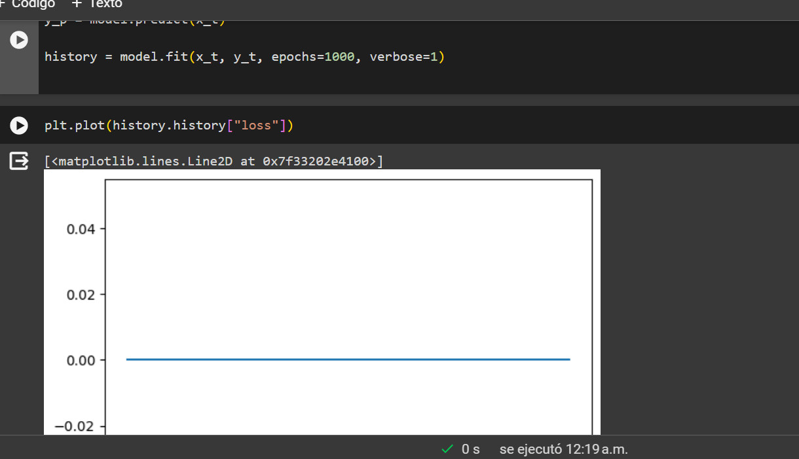

# Funciones, Modelos personalizados y Ecuaciones Diferenciales

Diseñar una capa en keras que transforme imágenes a color en escala degrises.
 
Al diseñar esta capa no tuve problema, aunque no la realize como se hizo en clase, pude obtener buenos resultados.

  <h4>Código de la red:</h4>
  

 

 ---

 Entrena una red neuronal para que reproduzca las siguientes funciones en el  intervalo  de  [-1,1].   Graficar  la  solución  de  la  red  en  conjunto  con  la gráfica de la función.
 
 (a)  $$3 sin(\pi x)$$
 
 (b) $$ 1 + 2x+ 4x^{3}$$

  <h4>Código de la red:</h4>
  

 
Con respecto a este ejercicio no tuve problema alguno, sin embargo, hice varias pruebas y la mejor es la que presento. Cuando termine de realizar todos los ejercicios vi que teniamos que tomar captura de todos los intentos, por esto mismo en lo que resta del reporte no habra evidencia de todos los intentos realizados.

---

Diseñar una capa entrenable que represente un polinomio grado 3: $$ f(x) =a0+a1x+a2x2+a3x3$$.  Los parámetros entrenables son los coeficientes $$ a0,a1,a2,a3$$. Posteriormente, entrenarla para ajustarla a la función $$ f(x) =cos(2x)$$ en el intervalo [-1,1].

  <h4>Código de la red:</h4>
  

 

Al entrenar esta red, la grafica de la función de costo me dio una recta, sin embargo, al aumentar el numero de de capas y de neuronas obtuve un mejor resultado, con respecto al esperado.
 

  

 
---

### Atribuciones

- Este repositorio cuenta con una  [GNU License](https://github.com/Jeremy-22/RN/blob/main/LICENSE).
